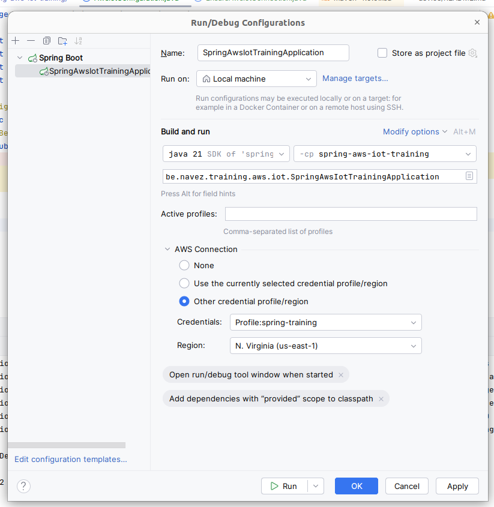

# Spring Training AWS IoT

This spring training covers Spring Web, Spring Data and Spring test. It also covers the integration with AWS IoT.

## Use case

You work as a developer in the field of industrial internet of thing (IIoT). You are responsible for creating a little proof of concept built around AWS IoT.

The goal of this PoC is to be able to push some data (configurations) to a device from a Spring Boot application. The firmware developers already did part of their work and provided you a device simulator mocking the device behavior.

Along different tasks, your job will be to create an api that communicates with AWS and that stores data.

---

## Tasks

### Endpoint returning a configuration

For this first step, start by creating a GET endpoint that returns a simple configuration. Feel free to put additional fields in this configuration. Exemple:

```json
{
	"id": "325f68a6-1e68-4705-93e8-09ed53ee05ae",
	"network": {
		"address": "123.48.237.210",
		"port": 443
	},
	"log": {
		"debug": false
	},
	"data": {
		"pollInterval": 60
	}
}
```

This object needs to be a Java object. The endpoint returns this configuration.

---

### Send a configuration to you service

From now, you have an endpoint that returns a data transfert object (DTO).

Your service should be able to receive a configuration and to validate its content. Create a POST endpoint that get this configuration and that validated those requirements:
* `pollInterval` should be greater than 0;
* `address` should not be null.
* You can add any other validation that seems relevant to you.

#### Extension: Id generation

The id is generated by you microservice. When sending a configuration to your endpoint, the endpoint returns the same configuration but with the `id` field being set.

---

### Store the configuration in a database

Now that you have a validated configuration, you need to store it in a database. Create a service and a repository handle the storage of the configuration object.

Be aware that you need to use a different object than the DTO to store it in the database. You will need to use an Entity object and map the DTO into an entity. You heard about [Mapstruct](https://www.baeldung.com/mapstruct) that could be a good help.

We will use H2, an in-memory database.

#### Extension 1: Addresses being an array

The scope changed and the field `network.address` is in fact `network.addresses`: an array. Apply this modification to your microservice.


#### Extension 2: Update a configuration

Create a PUT endpoint that allows updating the configuration. The endpoint should receive the updated configuration and update the corresponding record in the database.

---

### It's time to test you code

You already created some endpoints to be able to progresse with confidence, test your code with unit test.

#### Extension: Integration test

You heard about integration tests that can test the whole flow from the Controller to the Repository. Test you POST endpoint with a happy flow.

---

---

### Launch your simulated device

The firmware team just released a little python script simulating a device.

* [Set up you AWS account](aws/README.md);
* See [Device readme](device/README.md) to launch the IoT Device (Thing in AWS).

---

### Apply a configuration to your device

It's time to integrate your microservice with AWS IoT.

* Install and set up AWS Toolkit, the IntelliJ extension
* Set up your run configurations as described in the picture



Create an endpoint that applies a configuration to a device by creating a job. This endpoint takes a configuration ID and a thing name as parameters.

Behind this endpoint, you need to get the full configuration from the database and to send it to the device using a Job.

Useful links to start:
* [AWS IoT examples using SDK for Java 2.x](https://docs.aws.amazon.com/sdk-for-java/latest/developer-guide/java_iot_code_examples.html)

#### Extension: Domain layer & Hexagonal architecture

From now, you should have multiple object definition for a configuration: the DTO, the Entity and certainly another DTO for the communication with AWS Jobs.

Having a microservice using multiple infrastructure dependencies (data persistence + AWS layer) can become quite complex to manage and maintain.

For this extension, apply the Hexagonal architecture to your microservice. Your service will conceptually be split in 4 layers:
* Inbound (Your controllers)
* Domain (The domain logic)
* Persistence (The repository)
* Client (The AWS clients)

---

### Get the applied config

When receiving a configuration, the device applies it and then updates its shadow with the configuration ID.

To be complete, your microservice needs to expose an endpoint getting the actual configuration using the configuration ID coming from the shadow.

### General extensions

* Implement spring security with two authorities, READ and WRITE access;
* Return the date when the config has been applied using the shadow timestamp;
* Log the time taken by AWS to response to each of your request using Spring AOP
* Configure two ways to launch your service using spring profiles:
  * Profile 'dev' saves your data in a file;
  * Profile 'local' does not save it.
* Explore the transactional capabilities of Spring Data.